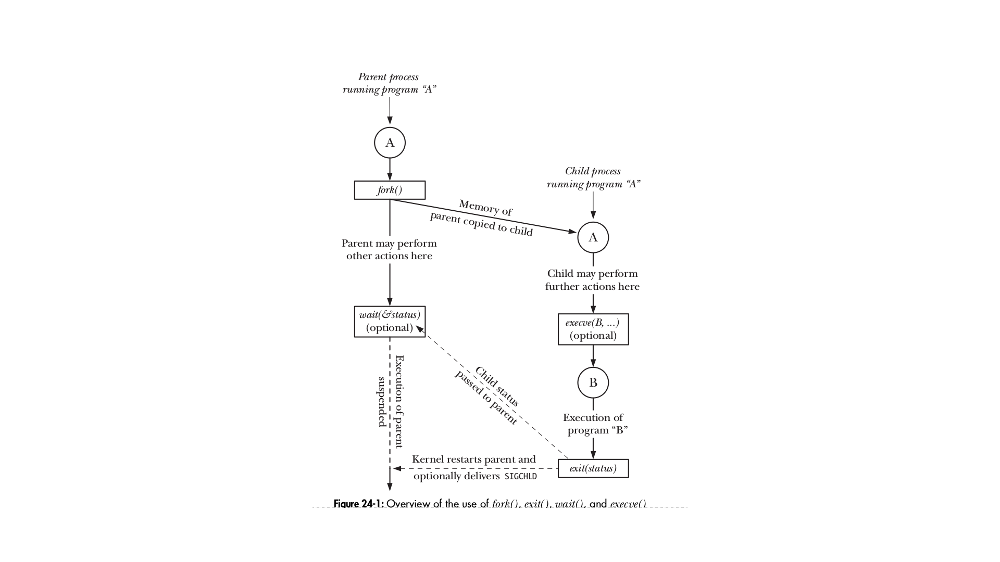

# **Linux Running Notes**
<!-- MarkdownTOC -->

1.  Kernels
- process
- Daemon processes
<!-- /MarkdownTOC -->

## Kernels
- Swap area : reserved area of disk space used to suplement computer's RAM
- The kernel maintains all of the low-level data structures that
enable the filenames used by programs to be translated into physical locations on
the disk.
- The kernel also maintains data structures that map the virtual memory of
each process into the physical memory of the computer and the swap area(s) on
disk.
- All communication between processes is done via mechanisms provided by
the kernel.

## Process memory layout
The memory allocated to each process is composed of a number of parts, usually
referred to as segments. These segments are as follows:
- The **text segment** contains the machine-language instructions of the program
run by the process. The text segment is made read-only so that a process
doesn’t accidentally modify its own instructions via a bad pointer value. Since
many processes may be running the same program, the text segment is made
sharable so that a single copy of the program code can be mapped into the vir-
tual address space of all of the processes.
- The **initialized data segment** contains global and static variables that are explic-
itly initialized. The values of these variables are read from the executable file
when the program is loaded into memory.
- The **uninitialized data segment** contains global and static variables that are not
explicitly initialized. Before starting the program, the system initializes all
memory in this segment to 0. For historical reasons, this is often called the bss
segment, a name derived from an old assembler mnemonic for “block started
by symbol.” The main reason for placing global and static variables that are ini-
tialized into a separate segment from those that are uninitialized is that, when a
program is stored on disk, **it is not necessary to allocate space for the uninitial-
ized data. Instead, the executable merely needs to record the location and size
required for the uninitialized data segment, and this space is allocated by the
program loader at run time**.
- The **stack** is a dynamically growing and shrinking segment containing stack
frames. One stack frame is allocated for each currently called function. A
frame stores the function’s local variables (so-called automatic variables), argu-
ments, and return value.
- The **heap** is an area from which memory (for variables) can be dynamically allo-
cated at run time. The top end of the heap is called the **program break**.

## Daemon processes
A _daemon_ is a special-purpose process that is created and handled by the system
in the same way as other processes, but which is distinguished by the following
characteristics:
- It is long-lived. A daemon process is often started at system boot and remains
in existence until the system is shut down.
- It runs in the background, and has no controlling terminal from which it can
read input or to which it can write output.

## Resource limits
Each process consumes resources, such as open files, memory, and CPU time.
Using the **setrlimit()** system call, a process can establish upper limits on its consumption of various resources. Each such resource limit has two associated values: a **soft limit**, which limits the amount of the resource that the process may consume; and a **hard limit**, which is a ceiling on the value to which the soft limit may be adjusted. An unprivileged process may change its soft limit for a particular resource to any value in the range from zero up to the corresponding hard limit, but can only lower its hard limit.

## Memory Mappings - mmap()
The mmap() system call creates a new memory mapping in the calling process’s virtual
address space.Mappings fall into two categories:
- A file mapping maps a region of a file into the calling process’s virtual memory.
Once mapped, the file’s contents can be accessed by operations on the bytes in
the corresponding memory region. The pages of the mapping are automati-
cally loaded from the file as required.
- By contrast, an anonymous mapping doesn’t have a corresponding file. Instead,
the pages of the mapping are initialized to 0.

When two or more processes share the same pages, each process may see the
changes made by other processes to the contents of the pages, depending on
whether the mapping is created as private or shared.
When a mapping is
- *private*, modifications to the contents of the mapping are not visible to other processes and are not carried through to the underlying file.
- *shared*, modifications to the contents of the mapping are visible to other processes sharing the samemapping and are carried through to the underlying file

Processes can use the **shmget()** and **mmap()** system calls to explicitly request
sharing of memory regions with other processes. This is done for the pur-
pose of interprocess communication.

## Mechanisms for interprocess communication (IPC) include the following:
- signals, which are used to indicate that an event has occurred;
- pipes (familiar to shell users as the | operator) and FIFOs, which can be used to
transfer data between processes;
- sockets, which can be used to transfer data from one process to another, either
on the same host computer or on different hosts connected by a network;
- file locking, which allows a process to lock regions of a file in order to prevent
other processes from reading or updating the file contents;
- message queues, which are used to exchange messages (packets of data) between
processes;
- semaphores, which are used to synchronize the actions of processes; and
- shared memory, which allows two or more processes to share a piece of memory.
When one process changes the contents of the

## The / proc File System
The /proc file system is a virtual file system that provides an interface to kernel
data structures in a form that looks like files and directories on a file system. This
provides an easy mechanism for viewing and changing various system attributes. In
addition, a set of directories with names of the form /proc/ PID, where PID is a pro-
cess ID, allows us to view information about each process running on the system.

## Atomicity and Race conditions
kernel guarantees that all of the steps in a system call are completed as a single
operation, without being interrupted by another process or thread.
Atomicity is essential to the successful completion of some operations. In par-
ticular, it allows us to avoid race conditions (sometimes known as race hazards). A
race condition is a situation where the result produced by two processes (or
threads) operating on shared resources depends in an unexpected way on the rela-
tive order in which the processes gain access to the CPU(s).

## **fcntl()**
The fcntl() system call performs a range of control operations on an open file
descriptor.
int fcntl(int fd , int cmd , ...);

## File descriptors and open filenames
Three data structures are maintained by the Kernels
- the per-process file descriptor table;
- the system-wide table of open file descriptions; and
- the file system i-node table.

**For each process, the kernel maintains a table of open file descriptors**. Each entry in this table records information about a single file descriptor, including:
- a set of flags controlling the operation of the file descriptor and
- a reference to the open file description.

The kernel maintains a system-wide table of all open file descriptions.

- Two different file descriptors that refer to the same open file description share
a file offset value. Therefore, if the file offset is changed via one file descriptor
(as a consequence of calls to read(), write(), or lseek()), this change is visible
through the other file descriptor. This applies both when the two file descrip-
tors belong to the same process and when they belong to different processes.
- Similar scope rules apply when retrieving and changing the open file status
flags (e.g., O_APPEND , O_NONBLOCK , and O_ASYNC ) using the fcntl() F_GETFL and F_SETFL
operations.
- By contrast, the file descriptor flags (i.e., the close-on-exec flag) are private to
the process and file descriptor. Modifying these flags does not affect other file
descriptors in the same process or a different process.

## The /dev/fd Directory
For each process, the kernel provides the special virtual directory /dev/fd . This
directory contains filenames of the form /dev/fd/ n, where n is a number correspond-
ing to one of the open file descriptors for the process.

## Creating Temporary Files
Some programs need to create temporary files that are used only while the pro-
gram is running, and these files should be removed when the program terminates.
For example, many compilers create temporary files during the compilation process
- *mkstemp()* and *tmpfile()*
- int mkstemp(char * template ) - template takes the form of a pathname
- FILE \*tmpfile(void);  On success, tmpfile() returns a file stream that can be used with the stdio library functions

## Programs and processes
A **process** is an instance of an executing program.Many processes might be running the same program 
A **program** is a file containing a range of information that describes how to con-
struct a process at run time.
This information includes the following:
- Binary format identification: Each program file includes metainformation describ-
ing the format of the executable file.
Machine-language instructions: These encode the algorithm of the program.
- Program entry-point address: This identifies the location of the instruction at
which execution of the program should commence.
- Data: The program file contains values used to initialize variables and also lit-
eral constants used by the program (e.g., strings).
- Symbol and relocation tables: These describe the locations and names of functions
and variables within the program. These tables are used for a variety of pur-
poses, including debugging and run-time symbol resolution (dynamic linking).
- Shared-library and dynamic-linking information: The program file includes fields
listing the shared libraries that the program needs to use at run time and the
pathname of the dynamic linker that should be used to load these libraries.
- Other information: The program file contains various other information that
describes how to construct a process.
###### The Linux kernel limits process IDs to being less than or equal to 32,767.Once it has reached 32,767, the process ID counter is reset to 300, rather than 1.

## Virtual memory
A virtual memory scheme splits the memory used by each program into small,fixed-size units called **pages**. Correspondingly, RAM is divided into a series of **page
frames** of the same size. At any one time, only some of the pages of a program need
to be resident in physical memory page frames; these pages form the so-called
resident set. Copies of the unused pages of a program are maintained in the **swap
area** — a reserved area of disk space used to supplement the computer’s RAM—and
loaded into physical memory only as required. When a process references a page
that is not currently resident in physical memory, a **page fault** occurs, at which point the kernel suspends execution of the process while the page is loaded from disk
into memory.

## Memory management
The current limit of the heap is referred to as the **program break**. 
*malloc()* returns void \*, we can assign it to any type of C pointer. The block
of memory returned by malloc() is always aligned on a byte boundary suitable for
any type of C data structure. In practice, this means that it is allocated on an 8-byte
or 16-byte boundary on most architectures. 
The free() function deallocates the block of memory pointed to by its ptr argu-
ment.free() doesn’t lower the program break, but instead adds the block of
memory to a list of free blocks that are recycled by future calls to malloc().

#### Debugging memory/malloc()
- The mtrace() and muntrace() functions allow a program to turn tracing of mem-
ory allocation calls on and off
- The mcheck() and mprobe() functions allow a program to perform consistency
checks on blocks of allocated memory; for example, catching errors such as
attempting to write to a location past the end of a block of allocated memory.

## Allocating Memory on the Stack: alloca()
instead of obtaining memory from the heap, alloca() obtains memory
from the stack by increasing the size of the stack frame.

### System limits
##### long sysconf(int name );  
Returns value of limit specified by name,or –1 if limit is indeterminate or an error occurred
##### long pathconf(const char * pathname , int name );
##### long fpathconf(int fd , int name );

## I/O Buffering
When working with disk files, the read() and write() system calls don’t directly ini-
tiate disk access. Instead, they simply copy data between a user-space buffer and a
buffer in the **kernel buffer cache**.Hence, we say that the system call is not synchronized with the disk operation.) If, in the interim, another process attempts to read these bytes of the file, then the kernel automatically supplies the data from the buffer cache,rather than from (the outdated contents of) the file.
Calls to **read()** fetch data from this buffer until it is exhausted, at
which point the kernel reads the next segment of the file into the buffer cache.

### Flushing a *stdio* buffer
Regardless of the current buffering mode, at any time, we can force the data in a
stdio output stream to be written (i.e., flushed to a kernel buffer via write()) using
the fflush() library function. This function flushes the output buffer for the speci-
fied stream. 
**If stream is NULL , fflush() flushes all stdio buffers.**

## processes

 

**fork()** : The fork() system call creates a new process, the child, which is an almost exact
duplicate of the calling process, the parent.The key point to understanding fork() is to realize that after it has completed its
work, two processes exist, and, in each process, execution continues from the point
where fork() returns.
The two processes are executing the same program text, but they have separate
copies of the stack, data, and heap segments. The child’s stack, data, and heap seg-
ments are initially exact duplicates of the corresponding parts the parent’s memory.
After the fork(), each process can modify the variables in its stack, data, and heap
segments without affecting the other process.

**vfork()** : Like fork(), vfork() is used by the calling process to create a new child process.
However, vfork() is expressly designed to be used in programs where the child per-
forms an immediate exec() call.  
Two features distinguish the vfork() system call from fork() and make it more efficient:
- No duplication of virtual memory pages or page tables is done for the child
process. Instead, the child shares the parent’s memory until it either performs
a successful exec() or calls \_exit() to terminate.
- **Execution of the parent process is suspended until the child has performed an
exec() or \_exit()**.    
These points have some important implications. Since the child is using the parent’s
memory, any changes made by the child to the data, heap, or stack segments will be
visible to the parent once it resumes. Furthermore, if the child performs a function
return between the vfork() and a later exec() or \_exit(), this will also affect the parent.

**The semantics of vfork() mean that after the call, the child is guaranteed to be
scheduled for the CPU before the parent. In Section 24.2, we noted that this is not
a guarantee made by fork(), after which either the parent or the child may be sched-
uled first.**  
_Refer 24.4 of A Linux and UNIX System Programming Handbook.pdf_

The vfork() system call is a more efficient
version of fork(), but is usually best avoided because of its unusual semantics,
whereby the child uses the parent’s memory until it either performs an exec() or
terminates; in the meantime, execution of the parent process is suspended

## Process termination
~~~~
void _exit(int status );
~~~~
The status argument given to \_exit() defines the termination status of the process,
which is available to the parent of this process when it calls wait().Although
defined as an int, only the bottom 8 bits of status are actually made available to the
parent. By convention, a termination status of 0 indicates that a process completed
successfully, and a nonzero status value indicates that the process terminatedunsuccessfully

## A simple implementation of system()
The system() function creates a child process that invokes a shell to execute
command. Here is an example of a call to system():
system("ls | wc");

The main cost of system() is inefficiency. Executing a command using system()
requires the creation of at least two processes—one for the shell and one or more
for the command(s) it executes—each of which performs an exec(). If efficiency or
speed is a requirement, it is preferable to use explicit fork() and exec() calls to exe-
cute the desired program.
Thus, to implement system(), we need to use fork() to create a child that then does
an execl() with arguments corresponding to the above sh command:
execl("/bin/sh", "sh", "-c", command, (char \*) NULL);
To collect the status of the child created by system(), we use a waitpid() call that specifies the child’s process ID

### Clone()
~~~~
int clone(int (* func ) (void *), void * child_stack , int flags , void * func_arg , ...
/* pid_t * ptid , struct user_desc * tls , pid_t * ctid */ );
~~~~
Returns process ID of child on success, or –1 on error
Like fork(), a new process created with clone() is an almost exact duplicate of the parent.
Unlike fork(), the cloned child doesn’t continue from the point of the call, but
instead commences by calling the function specified in the func argument; we’ll
refer to this as the child function.When called, the child function is passed the value
specified in func_arg

## Threads
~~~~
#include <pthread.h>
int pthread_create(pthread_t * thread , const pthread_attr_t * attr ,
void *(* start )(void *), void * arg );
Returns 0 on success, or a positive error number on error
~~~~

The new thread commences execution by calling the function identified by start
with the argument arg (i.e., start(arg)). The thread that calls pthread_create() continues
execution with the next statement that follows the call.  
The *arg* argument is declared as void \*, meaning that we can pass a pointer to
any type of object to the start function. Typically, arg points to a global or heap vari-
able, but it can also be specified as NULL . If we need to pass multiple arguments to
start, then arg can be specified as a pointer to a structure containing the arguments
as separate fields. With judicious casting, we can even specify arg as an int.
Strictly speaking, the C standards don’t define the results of casting int to void *
and vice versa. However, most C compilers permit these operations, and they
produce the desired result; that is,
~~~~
//Integer being casted as void.

int j == (int) ((void *) j)
~~~~

~~~~
include <pthread.h>
void pthread_exit(void * retval );
~~~~
Calling pthread_exit() is equivalent to performing a return in the thread’s start func-
tion, with the difference that pthread_exit() can be called from any function that has
been called by the thread’s start function.

The pthread_join() function waits for the thread identified by thread to terminate. (If
that thread has already terminated, pthread_join() returns immediately.) This opera-
tion is termed joining.
~~~~
include <pthread.h>
int pthread_join(pthread_t thread , void ** retval );
Returns 0 on success, or a positive error number on error
~~~~
If a thread is not detached , then we must join with it using
pthread_join(). If we fail to do this, then, when the thread terminates, it produces
the thread equivalent of a zombie process (Section 26.2). Aside from wasting system
resources, if enough thread zombies accumulate, we won’t be able to create addi-
tional threads.
By default, a thread is joinable, meaning that when it terminates, another thread
can obtain its return status using pthread_join().

Sometimes, we don’t care about
the thread’s return status; we simply want the system to automatically clean up and
remove the thread when it terminates. In this case, we can mark the thread as detached,
by making a call to pthread_detach() specifying the thread’s identifier in thread.
~~~~
#include <pthread.h>
int pthread_detach(pthread_t thread );
Returns 0 on success, or a positive error number on error
~~~~
Thread detaching itself
~~~~
pthread_detach(pthread_self());
~~~~

#### Threads Versus Processes
Threads over Processes:
- Sharing data between threads is easy
- Thread creation is faster than process creation; context-switch time may be
lower for threads than for processes.

Processes over Threads
- When programming with threads, we need to ensure that the functions we call
are thread-safe or are called in a thread-safe manner.Multiprocess applications don’t need to be
concerned with this.
- A bug in one thread (e.g., modifying memory via an incorrect pointer) can dam-
age all of the threads in the process, since they share the same address space and
other attributes. By contrast, processes are more isolated from one another.
- Each thread is competing for use of the finite virtual address space of the host
process.

- Dealing with signals in a multithreaded application requires careful design
- In a multithreaded application, all threads must be running the same program
(although perhaps in different functions). In a multiprocess application, differ-
ent processes can run different programs.

~~~~
In a multithreaded process, multiple threads are concurrently executing the same
program. All of the threads share the same global and heap variables, but each
thread has a private stack for local variables. The threads in a process also share a
number of other attributes, including process ID, open file descriptors, signal dis-
positions, current working directory, and resource limits.
~~~~
## Thread synchronization

~~~~
#include <pthread.h>
pthread_mutex_t mtx = PTHREAD_MUTEX_INITIALIZER;
int pthread_mutex_lock(pthread_mutex_t * mutex );
int pthread_mutex_unlock(pthread_mutex_t * mutex );
Both return 0 on success, or a positive error number on error
~~~~

#### pthread_mutex_trylock() and pthread_mutex_timedlock()
The Pthreads API provides two variants of the pthread_mutex_lock() function:
pthread_mutex_trylock() and pthread_mutex_timedlock().
The pthread_mutex_trylock() function is the same as pthread_mutex_lock(), except
that if the mutex is currently locked, pthread_mutex_trylock() fails, returning the
error EBUSY .
The pthread_mutex_timedlock() function is the same as pthread_mutex_lock(),
except that the caller can specify an additional argument, abstime, that places a limit
on the time that the thread will sleep while waiting to acquire the mutex. If the time
interval specified by its abstime argument expires without the caller becoming the
owner of the mutex, pthread_mutex_timedlock() returns the error ETIMEDOUT .
~~~~
The simplest way to avoid such deadlocks is to define a mutex hierarchy. When
thread
~~~~

#### PTHREAD_MUTEX_NORMAL
(Self-)deadlock detection is not provided for this type of mutex. If a thread
tries to lock a mutex that it has already locked, then deadlock results.
Unlocking a mutex that is not locked or that is locked by another thread
produces undefined results. (On Linux, both of these operations succeed
for this mutex type.)
#### PTHREAD_MUTEX_ERRORCHECK
Error checking is performed on all operations. All three of the above scenarios
cause the relevant Pthreads function to return an error. This type of mutex
is typically slower than a normal mutex, but can be useful as a debugging
tool to discover where an application is violating the rules about how a
mutex should be used.
#### PTHREAD_MUTEX_RECURSIVE
A recursive mutex maintains the concept of a lock count. When a thread
first acquires the mutex, the lock count is set to 1. Each subsequent lock
operation by the same thread increments the lock count, and each unlock
operation decrements the count. The mutex is released (i.e., made avail-
able for other threads to acquire) only when the lock count falls to 0.
Unlocking an unlocked mutex fails, as does unlocking a mutex that is cur-
rently locked by another thread.

~~~~
#include <pthread.h>
int pthread_cond_signal(pthread_cond_t * cond );
int pthread_cond_broadcast(pthread_cond_t * cond );
int pthread_cond_wait(pthread_cond_t * cond , pthread_mutex_t * mutex );
// All return 0 on success, or a positive error number on error

int pthread_cond_timedwait(pthread_cond_t * cond , pthread_mutex_t * mutex ,
const struct timespec * abstime );
Returns 0 on success, or a positive error number on error
~~~~

If
the time interval specified by abstime expires without the condition variable being
signaled, then pthread_cond_timedwait() returns the error ETIMEDOUT .

### Thread Specific Data
The general steps that a library function performs in order to use thread-specific
data are as follows:
660
1. The function creates a key, which is the means of differentiating the thread-specific
data item used by this function from the thread-specific data items used by
other functions. The key is created by calling the pthread_key_create() function.
Creating a key needs to be done only once, when the first thread calls the function.
For this purpose, pthread_once() is employed. Creating a key doesn’t allocate
any blocks of thread-specific data.
- The call to pthread_key_create() serves a second purpose: it allows the caller to
specify the address of the programmer-defined destructor function that is used
to deallocate each of the storage blocks allocated for this key (see the next
step). When a thread that has thread-specific data terminates, the Pthreads API
automatically invokes the destructor, passing it a pointer to the data block for
this thread.
- The function allocates a thread-specific data block for each thread from which
it is called. This is done using malloc() (or a similar function). This allocation is
done once for each thread, the first time the thread calls the function.
- In order to save a pointer to the storage allocated in the previous step, the func-
tion employs two Pthreads functions: pthread_setspecific() and pthread_getspecific().
A call to pthread_setspecific() is a request to the Pthreads implementation to say
“save this pointer, recording the fact that it is associated with a particular key (the
one for this function) and a particular thread (the calling thread).” Calling
pthread_getspecific() performs the complementary task, returning the pointer pre-
viously associated with a given key for the calling thread. If no pointer was
previously associated with a particular key and thread, then pthread_getspecific()
returns NULL . This is how a function can determine that it is being called for the
first time by this thread, and thus must allocate the storage block for the thread.
~~~~
#include <pthread.h>
int pthread_key_create(pthread_key_t * key , void (* destructor )(void *));
Returns 0 on success, or a positive error number on error
~~~~
Upon termination of a thread that has a non- NULL value associated with key, the
destructor function is automatically invoked by the Pthreads API and given that
value as its argument. The passed value is normally a pointer to this thread’s
thread-specific data block for this key. If a destructor is not required, then destructor
can be specified as NULL

The pthread_setspecific() function requests the Pthreads API to save a copy of value
in a data structure that associates it with the calling thread and with key, a key
returned by a previous call to pthread_key_create(). The pthread_getspecific() function
performs the converse operation, returning the value that was previously associ-
ated with the given key for this thread.
~~~~
#include <pthread.h>
int pthread_setspecific(pthread_key_t key , const void * value );
Returns 0 on success, or a positive error number on error
void *pthread_getspecific(pthread_key_t key );
// Returns pointer, or NULL if no thread-specific data isassociated with key
~~~~

### Cleanup Handlers
If a thread with a pending cancellation were simply terminated when it reached a
cancellation point, then shared variables and Pthreads objects (e.g., mutexes)
might be left in an inconsistent state, perhaps causing the remaining threads in the
process to produce incorrect results, deadlock, or crash. To get around this problem,
a thread can establish one or more cleanup handlers—functions that are automati-
cally executed if the thread is canceled. A cleanup handler can perform tasks such
as modifying the values of global variables and unlocking mutexes before the
thread is terminated.
Each thread can have a stack of cleanup handlers. When a thread is canceled,
the cleanup handlers are executed working down from the top of the stack; that is,
the most recently established handler is called first, then the next most recently
established, and so on. When all of the cleanup handlers have been executed, the
thread terminates.
The pthread_cleanup_push() and pthread_cleanup_pop() functions respectively
add and remove handlers on the calling thread’s stack of cleanup handlers.
~~~
#include <pthread.h>
void pthread_cleanup_push(void (* routine )(void*), void * arg );
void pthread_cleanup_pop(int execute );
The pthread_cleanup_push() function adds the function whose address is specified
in routine to the top of the calling thread’s stack of cleanup handlers
~~~

### Sending a Signal to a Thread
The pthread_kill() function sends the signal sig to another thread in the same process.
The target thread is identified by the argument thread.
~~~~
#include <signal.h>
int pthread_kill(pthread_t thread , int sig );
Returns 0 on success, or a positive error number on error
~~~~

### Threads and exec()
When any thread calls one of the exec() functions, the calling program is completely
replaced. All threads, except the one that called exec(), vanish immediately. None of
the threads executes destructors for thread-specific data or calls cleanup handlers.
All of the (process-private) mutexes and condition variables belonging to the process
also disappear. After an exec(), the thread ID of the remaining thread is unspecified.

### Threads and fork()
When a multithreaded process calls fork(), only the calling thread is replicated in
the child process. (The ID of the thread in the child is the same as the ID of the
thread that called fork() in the parent.) All of the other threads vanish in the child;
no thread-specific data destructors or cleanup handlers are executed for those
threads

### Persistence
The term persistence refers to the lifetime of an IPC object.  
**Process persistence**: A process-persistent IPC object remains in existence only as
long as it is held open by at least one process. If the object is closed by all pro-
cesses, then all kernel resources associated with the object are freed, and any
unread data is destroyed. Pipes, FIFOs, and sockets are examples of IPC facilities
with process persistence.  
**Kernel persistence**: A kernel-persistent IPC object exists until either it is explicitly
deleted or the system is shut down. The lifetime of the object is independent of
whether any process holds the object open. This means that, for example, one
process can create an object, write data to it, and then close it (or terminate).
At a later point, another process can open the object and read the data. 
**File-system persistence**: An IPC object with file-system persistence retains its infor-
mation even when the system is rebooted. The object exists until it is explicitly
deleted. The only type of IPC object that demonstrates file-system persistence
is shared memory based on a memory-mapped file.

- communication facilities provided on Linux are pipes, FIFOs, sockets,
message queues, and shared memory.
- Synchronization facilities provided on Linux
include semaphores and file locks.
